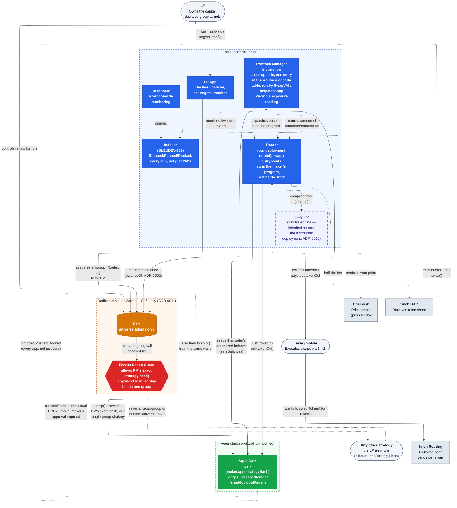
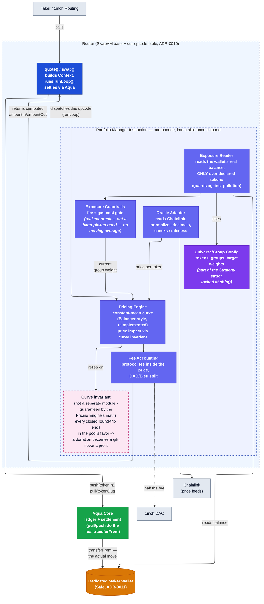

# Architecture

**Status: Milestone 1 complete.** The strategy ships as a new swapVM instruction, deployed via an independent router we own (inheriting `SwapVM` with our own opcode set) — not a pure `AquaApp`, not a hybrid, and not merged into 1inch's own `AquaSwapVMRouter`. See [`adr/0010-on-chain-form-aquaapp-vs-swapvm-instruction.md`](adr/0010-on-chain-form-aquaapp-vs-swapvm-instruction.md) for the full decision and reasoning. The frontier comparison is done now — see [Milestone 1](#milestone-1) below for the current result, not restated here since it's exactly the kind of thing that changes as assumptions get corrected. The round-trip/donation-resistance proof is done ([ADR-0007](adr/0007-donation-resistance-via-curve-invariant.md)); the cross-strategy manipulation gap it doesn't cover is closed structurally, not proven, by a Safe wallet requirement and a Basket Scope Guard, now built and tested ([ADR-0011](adr/0011-safe-wallet-with-basket-scope-guard.md)).

Every other design choice reflected in the diagrams below has its own ADR in [`adr/`](adr/README.md) — see the component notes for links.

**Why an independent router, not `AquaApp` and not merged into 1inch's own router.** Reading the actual `lib/swap-vm` source is what settled this:

- **A swapVM instruction isn't something a strategy author can add unilaterally.** The opcode table (`AquaOpcodes._opcodes()` in `lib/swap-vm/src/opcodes/AquaOpcodes.sol`) is a fixed-size array of internal function pointers baked into whichever router contract deploys it — currently `AquaSwapVMRouter`, holding 1inch's own opcode set (`XYCSwap`, `XYCConcentrate`, `Decay`, `Fee`, `PeggedSwap`, `Extruction` — no weighted/constant-mean curve). Adding our own opcode to *that* router means 1inch merging and redeploying it. Deploying *our own* router (inheriting `SwapVM` with a custom opcode set) is technically possible but pulls in the entire `SwapVM.sol` plumbing (EIP-712 order signing, taker-traits parsing, WETH unwrap, maker hooks/callbacks) as part of our own deployed, audited surface — most of it irrelevant to a single-strategy portfolio manager.
- **Instructions can hold persistent storage** — `Invalidators.sol` proves this (per-maker, per-order mappings, gated by `!ctx.vm.isStaticContext` so `quote()` calls don't mutate state). The earlier assumption that swapVM instructions are necessarily stateless/pure (true of `XYCSwap._xycSwapXD`, which is `pure`) doesn't generalize — the framework supports exactly the kind of persistent EMA/smoothing state [ADR-0006](adr/0006-exposure-smoothing.md) needs. This removes one presumed blocker, but not the router-deployment problem above.
- **A real "hybrid" is narrower than it first sounds.** `SwapVM.swap()`/`quote()` are full external entrypoints built around taker-initiated calls with their own order/signature semantics — an external `AquaApp` can't cheaply "call into" the deployed router for just the pricing math; the instruction functions (like `_xycSwapXD`) are `internal`, reachable only by inheriting the instruction contract directly. That's really the `AquaApp` path with an optional pure-math import — not meaningfully different from ADR-0010's first option, since swapVM ships no weighted curve to import in the first place.

This is what decided it: merging into 1inch's own router carries a cooperation/timeline dependency neither of the other two paths do, and the PoC already proves the own-router path works for the multi-token-balance-read question. The M1 simulation's gas-cost sweeps and tracking-error/cost frontier weren't the basis for this decision either — see [Milestone 1](#milestone-1) below for that result, now complete. See [ADR-0010](adr/0010-on-chain-form-aquaapp-vs-swapvm-instruction.md) for the full record.

## System context (L1)

**What this grant builds** (blue boxes): the pricing instruction, the router that hosts it (ADR-0010 — our own, not 1inch's shared `AquaSwapVMRouter`), the LP-facing web app, the indexer that feeds visibility into wallet strategy state, and the protocol-wide monitoring dashboard. Everything else — Aqua core, the SwapVM base contract our router inherits, Chainlink, 1inch's own routing — already exists; we only integrate against it.

**The Router vs. the Instruction — a distinction earlier revisions of this diagram collapsed.** The Router is the contract a taker calls (`quote()`/`swap()`); it's also the `app` address Aqua's ledger is keyed on at `ship()` time — "app" here is just Aqua's generic term for whoever ships a strategy, **not** the same thing as the named `AquaApp` base contract (see [ADR-0010](adr/0010-on-chain-form-aquaapp-vs-swapvm-instruction.md)'s clarification; our Router is an app to Aqua, but doesn't inherit `AquaApp.sol`). The Router reads `AQUA.safeBalances(maker, address(this), strategyHash, ...)` — scoped to itself as `app` — runs the maker's program, and settles by calling `AQUA.pull()` / `AQUA.push()`. Aqua does the actual `IERC20.transferFrom` on settlement, moving real tokens directly between the Safe and the taker (`pull`) or between the Router and the Safe (`push`) — this requires the Safe to have approved Aqua for every universe token, an onboarding step not yet written up anywhere (owed alongside the migration checklist [ADR-0002](adr/0002-dedicated-maker-wallet-as-portfolio-scope.md) already flags). The Instruction is just the one opcode in the Router's table our pricing logic occupies, invoked mid-program. `AQUA.pull()` is keyed by `msg.sender`, i.e. by Router address — only the Router that shipped a given `strategyHash` can ever pull for it, which is exactly why [ADR-0011](adr/0011-safe-wallet-with-basket-scope-guard.md) anchors trust to the strategy hash and not to the Router's address (a Router can be `msg.sender` for many different strategies, not just PM's).

**The dedicated maker wallet** (orange) is the load-bearing design choice: a fresh **Safe** — not an EOA, see [ADR-0011](adr/0011-safe-wallet-with-basket-scope-guard.md) — the LP creates and funds only with universe tokens. Every strategy shipped from it settles into it, so its real, on-chain, `balanceOf`-readable balance already *is* the true net exposure — no new accounting primitive needed, and zero protocol changes (see [ADR-0002](adr/0002-dedicated-maker-wallet-as-portfolio-scope.md) for why this reads `balanceOf` directly and not `AQUA.safeBalances()`, which is a same-strategy-only ledger, not a wallet-wide reading).

**The Basket Scope Guard** (red) is what makes that safe to share with other strategies at all. It's a Safe Transaction Guard, not part of the strategy contract itself — installed on the wallet, it inspects every `ship()` call before the Safe makes it. PM's own, exact strategy hash is always allowed (it's the trusted mechanism meant to price across groups); anything else must stay within a single declared group, and can't touch a token outside the universe at all. See [ADR-0011](adr/0011-safe-wallet-with-basket-scope-guard.md) and [`thoughts/basket-scope-guard-design.md`](../thoughts/basket-scope-guard-design.md) for the mechanism and its real limits (module-transaction coverage, pre-existing strategies, guard removal).

**The Indexer** (BLEUDEV-339) is what gives visibility into what the Guard can't prevent or see: it only governs `ship()` calls made *after* it's installed on a given wallet, and has no view into strategies shipped through other apps entirely. The Indexer reads `Shipped`/`Pushed`/`Docked` directly off Aqua Core — across **every app**, not scoped to our own Router — into one `Strategy` entity per `(maker, app, strategyHash)`, tracking which tokens a strategy declared at ship time and whether it's still active. A general-purpose registry, not a decision-making or alerting system: an earlier revision also auto-flagged wallets holding both an active PM strategy and an active non-PM one, verified working, then removed as premature complexity — the same underlying query (`Strategy` filtered by maker and active state) still answers "does this wallet already have something active" for any future consumer, including the onboarding pre-existing-strategy check this was originally scoped to unblock. See [`thoughts/indexer-architecture.md`](../thoughts/indexer-architecture.md) for the full design.

## Contract internals (L2)

### Component notes, grounded against the real Aqua interfaces

- **Universe/Group Config** — part of the `strategy` bytes payload passed to [`IAqua.ship()`](../lib/aqua/src/interfaces/IAqua.sol), hashed into the immutable `strategyHash`. There is no update path; changing a parameter means shipping a new strategy and docking the old one via [`IAqua.dock()`](../lib/aqua/src/interfaces/IAqua.sol). See [ADR-0002](adr/0002-dedicated-maker-wallet-as-portfolio-scope.md) and [ADR-0003](adr/0003-oracle-valued-token-groups.md).
- **Exposure Reader** — reads via plain `balanceOf(token)` on the maker wallet, **not** `AQUA.rawBalances`/`safeBalances` (those are the same per-`(maker, app, strategyHash)` ledger, scoped to this one strategy only — not a wallet-wide reading; see [ADR-0002](adr/0002-dedicated-maker-wallet-as-portfolio-scope.md) for the full correction), and **only over tokens the LP declared** in the Config — anything else sitting in the wallet (by accident or an intentional donation) is ignored by this read. For a group holding more than one token, the per-token `balanceOf` reads feed the Oracle Adapter below, which converts and sums them into the one oracle-valued group total that `PRICING.md` and [ADR-0003](adr/0003-oracle-valued-token-groups.md) call `B_i`/`B_o` — the Exposure Reader itself only ever reads raw balances, it doesn't price them.
- **Exposure Guardrails** — a fee + gas-cost profitability gate on the *current* real reading, no moving average, no separate hand-picked dead-zone or cooldown (a real sweep found neither reduces cost once correction is gated on real economics). Donation resistance doesn't depend on these — that's fully closed by the curve invariant alone (see Invariant below). Cross-strategy resistance also doesn't depend on these — it's not this contract's job at all: it's closed structurally, at the wallet level, by the Basket Scope Guard ( [ADR-0011](adr/0011-safe-wallet-with-basket-scope-guard.md), see the L1 diagram above). These guardrails exist only to reduce unnecessary rebalancing churn and cost. See [ADR-0006](adr/0006-exposure-smoothing.md).
- **Oracle Adapter** — Chainlink-style push feeds only, not a pull oracle (Pyth was considered and rejected specifically because the taker could choose which still-valid price to post — see [ADR-0005](adr/0005-chainlink-push-oracles.md)). Two jobs, both per-feed: check each read's `updatedAt` against a configured max-staleness threshold and **revert the whole trade** if any group member involved fails that check (no fallback price, no degraded execution — see ADR-0005's Decision); and, for a multi-token group, convert each member's balance through its own price and sum into the one value the Pricing Engine treats as `B_i` or `B_o` (ADR-0003). The reference PoC (`BasketXYCSwap.sol`) doesn't implement this conversion yet — it adds a basket token's raw balance with no price applied, correct only by coincidence when every group member is worth the same. The simulation model (`simulation/src/aqua_sim/basket.py`) has the corrected, price-converting version — currently on a separate open PR (#12), not yet merged as of this writing.
- **Pricing Engine** — the constant-mean weighted curve, i.e. Balancer's weighted-pool formula (the 80/20 BAL/WETH pool is the best-known public example of this exact math with unequal weights), *reimplemented from scratch*. See [`THIRD_PARTY_NOTICES.md`](../THIRD_PARTY_NOTICES.md) and [ADR-0004](adr/0004-constant-mean-weighted-curve-pricing.md) for why the formula is fine to reuse but Balancer's GPL-licensed Solidity is not. Full formula: [`PRICING.md`](PRICING.md).
- **Curve invariant** — not its own contract or function, a *property* the Pricing Engine's math must satisfy: any closed round-trip trade ends slightly in the strategy's favor. That property is what turns a "donation attack" (transferring tokens into the wallet to skew the reading) into an irreversible gift rather than an extractable profit — proven, not just asserted (see [`DONATION-RESISTANCE-PROOF.md`](DONATION-RESISTANCE-PROOF.md) and [ADR-0007](adr/0007-donation-resistance-via-curve-invariant.md)). This proof covers PM's own trades and pure donations — it does **not**, by itself, cover a *different* strategy trading against the same wallet (that's a two-sided balance change, not a donation, and [`thoughts/cross-strategy-manipulation.md`](../thoughts/cross-strategy-manipulation.md) found a concrete exploit through exactly that gap). What makes the invariant's precondition hold for cross-strategy activity too is the Basket Scope Guard ([ADR-0011](adr/0011-safe-wallet-with-basket-scope-guard.md)), not this proof.
- **Fee Accounting** — the 2 bps protocol fee must be computed *inside* the same cost model used to evaluate the mechanism against baselines (see [ADR-0008](adr/0008-success-metrics-tracking-error-and-cost.md)) — comparing the strategy's all-in cost including this fee against a fee-free naive baseline would overstate how well the mechanism performs.
- **Reentrancy** — handled by `SwapVM.sol` itself, not `AquaApp`'s `nonReentrantStrategy` modifier: a per-`orderHash` transient lock (`_reentrancyGuards[orderHash]`) taken before the instruction runs and released after. Since the strategy is a swapVM instruction on our own router (ADR-0010), this guard is inherited from the base framework, not something the instruction itself has to implement.

## Milestone 1

- **Formal proof** of the round-trip/donation-resistance invariant — done: any closed round-trip ends at or above where it started, proven algebraically and independent of how the pre-trade balance arose (the strategy's own trades or a donation), then checked against the implementation across 200,000 random trades. See [`DONATION-RESISTANCE-PROOF.md`](DONATION-RESISTANCE-PROOF.md), [ADR-0007](adr/0007-donation-resistance-via-curve-invariant.md), and [`test_curve.py`](../simulation/tests/test_curve.py).
- **Cross-strategy manipulation** (a different strategy on the same wallet skewing the balance PM prices against) — closed structurally, not proven mathematically: see [ADR-0011](adr/0011-safe-wallet-with-basket-scope-guard.md). The Guard contract is now written, compiled, and tested — [`proofs-of-concept/basket-scope/`](../proofs-of-concept/basket-scope/), standalone, 12/12 tests passing including integration tests against a real deployed Safe — no longer the sketch in [`thoughts/basket-scope-guard-design.md`](../thoughts/basket-scope-guard-design.md). Still open: an external audit, and the onboarding flow's one-time pre-existing-strategy check it depends on.
- **Concrete parameter values** — resolved, but the resolution is "there are none to pick." `fee` is fixed by [ADR-0008](adr/0008-success-metrics-tracking-error-and-cost.md) (2 bps); a tolerance band and rate cap were tried and swept against a realistic gas cost, found to not reduce cost at all (fee savings from correcting less often get cancelled out by more value leaking to the market while the pool sits stale), and dropped. The mechanism corrects whenever doing so is profitable net of fee + gas — a real gas-cost placeholder (based on current observed L2 transaction costs, not this specific contract), not a hand-tuned percentage. See [ADR-0006](adr/0006-exposure-smoothing.md).
- **Licensing** — see [`LICENSING-RISK.md`](LICENSING-RISK.md) and [ADR-0001](adr/0001-license-under-aqua-source-not-mit.md). This affects what "open source" actually means for this repo's own contracts, independent of the mechanism design.
- **Routing discoverability — still genuinely open, not just a formality.** Deploying our own Router (ADR-0010) makes shipping unilateral, but it doesn't by itself confirm 1inch's own routing/solver infrastructure will find and price against an independently-deployed `SwapVM` router the way it does `AquaSwapVMRouter`. This is tracked as an open M4-milestone item in Linear (see [`ROADMAP.md`](ROADMAP.md)): confirm the strategy is reachable through 1inch's own routing, not only via direct calls. Worth resolving directly with 1inch rather than assuming the SwapVM interface alone buys discoverability — if it doesn't, that's true whether the strategy is a `SwapVM` instruction or a plain `AquaApp`, and changes what "the point of using SwapVM" actually is (see [ADR-0010](adr/0010-on-chain-form-aquaapp-vs-swapvm-instruction.md)).

### Simulation results

Nine notebooks (`simulation/notebooks/`), each with real assertions checked in code, not just printed claims. Results aren't restated here — per review, a second copy of notebook findings in this document is exactly the kind of thing that goes stale independently as the underlying code and assumptions get corrected, which happened more than once already in this project's history. See [`simulation/README.md`](../simulation/README.md) for what each notebook covers and its current result, and each notebook's own summary for the full detail.

**Scope not covered, regardless of the specific numbers on any given day:** performance under live trading, real gas costs (every notebook uses a placeholder based on current observed L2 transaction costs, not this specific contract's actual gas usage), multi-token group routing beyond the two-token pair every notebook models, and real aggregator routing behavior (compared against quoted prices directly, not live 1inch routing decisions). Closing that gap is M2 (testnet, real transactions) and M4 (mainnet, real capital and unpredictable traders) — this milestone doesn't substitute for either.

See [`adr/README.md`](adr/README.md) for the full decision log, including chain choice ([ADR-0009](adr/0009-deploy-on-an-l2-at-launch.md)) and the group/pricing/oracle decisions behind the diagrams above.
