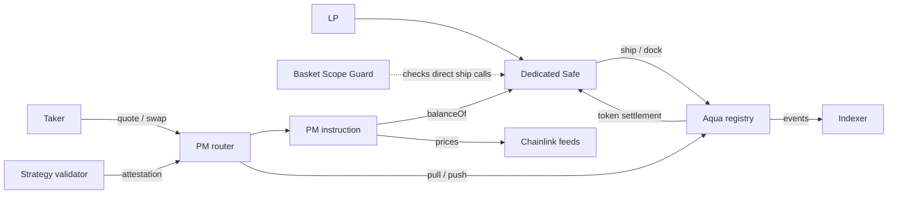

# Architecture

Portfolio Manager (PM) prices trades between token groups using a dedicated Safe wallet's actual balances.
The liquidity provider (LP) chooses the supported tokens, each group's target share, price feeds, and fees.
The wallet supplying tokens is the maker.
These settings form a strategy that cannot be edited after registration. Traders (takers) choose when to trade. PM does not initiate trades.

Aqua calls registering a strategy "shipping" (`ship()`) and disabling it "docking" (`dock()`).
The router receives trade requests. Price feeds, also called oracles, supply token prices.
The validator records passed checks as an attestation. The Guard checks which strategies the Safe can register.

## Components

| Component | Responsibility |
|---|---|
| `PortfolioManagerRouter` | Reuses SwapVM's public functions, order handling, token transfers, and lock against nested execution of the same order. |
| `PortfolioManagerSwap` | Reads group values, checks validation records and price limits, prices trades, and attempts the DAO fee transfer. |
| `PortfolioManagerArgsCodec` | Encodes and checks the fixed group settings. |
| `OracleAdapter` | Checks the age of each price and converts balances to a common value unit. |
| `PortfolioManagerPricing` | Applies the weighted pricing formulas, rounding in the pool's favor. |
| `PortfolioManagerStrategyValidator` | Checks the token list and initial asset mix, then records the result. |
| `BasketScopeGuard` | Restricts direct Aqua `ship()` calls from the Safe by strategy hash and token group. |
| Indexer | Tracks strategies across all Aqua apps. See its [README](../apps/indexer/README.md). |

Contract sources are in [packages/contracts/src](../packages/contracts/src/).
The LP app and monitoring dashboard remain part of the planned grant scope.

## Balances and configuration

Pricing uses each declared token's `balanceOf(maker)` so it includes token transfers from all the wallet's strategies.
Every group member uses its own oracle feed, including members of single-token groups.
All feeds must price tokens in the same currency, such as USD.

Aqua's `safeBalances` and `rawBalances` read its balance records (ledger), kept separately for each `(maker, app, strategyHash)`.
Those records limit how much each strategy can transfer. They do not measure the wallet's total holdings.
The router is the `app` address for PM strategies.

The strategy hash identifies the exact encoded order and its settings.
Changing the configuration requires a new strategy.
The Guard's trusted hash and token groups cannot be edited, so changes to them also require a new Guard.
See [ADR-0002](adr/0002-dedicated-maker-wallet-as-portfolio-scope.md) and [ADR-0011](adr/0011-safe-wallet-with-basket-scope-guard.md).

## Trade flow

1. SwapVM checks the order and starts the PM instruction.
2. PM requires a record of passed validation for the order hash before decoding the settings.
3. PM checks which groups the traded tokens belong to and requires different groups.
4. PM reads both groups' real balances and oracle prices.
5. If enabled, the price limit check (circuit breaker) measures how far the pair's current price is from its target.
6. PM converts the traded amount to value units and computes the quote.
7. PM converts the result to each token's own units and checks the output token's available balance.
8. During execution, PM attempts the DAO fee transfer. Quotes skip this transfer.
9. SwapVM completes token transfers through Aqua's `pull()` and `push()` calls.

The Safe must approve Aqua to transfer each declared token.
See [wallet setup](guides/fresh-wallet-setup.md) and [pricing](PRICING.md) for the procedure and formulas.

## Security boundaries

- **Current balances:** pricing has no moving average. Simulated traders act when a trade covers fees and transaction costs (gas). The contract does not schedule these trades.
- **Oracles:** a price that is too old, zero, or negative causes the trade to fail. Every feed in either traded group must pass.
- **Attestation:** records checks on the encoded settings. It does not enforce the token list used by a later `ship()` call or guarantee that wallet balances remain unchanged.
- **Guard coverage:** the Guard checks direct Aqua `ship()` calls. It does not inspect calls nested inside a batch or other contract.
- **Wallet control:** owners can withdraw tokens or remove the Guard. Setup must separately check prior strategies and Safe extensions (modules) that can make unrestricted calls.
- **Circuit breaker:** the price check can block a pair that is too far from target until an outside action restores it. See [ADR-0012](adr/0012-price-deviation-circuit-breaker.md).
- **Invariant (the formula's mathematical guarantee):** the [proof](DONATION-RESISTANCE-PROOF.md) concerns the curve's own trades and donations under its stated assumptions. It is not a guarantee about arbitrary wallet activity.
- **Protocol fee:** the transfer is part of the pricing instruction, but collection can fail. A failed transfer emits `ProtocolFeeSkipped` and does not stop the swap.

## Integration and evidence

The independent router requires manual inclusion by 1inch for Pathfinder routing, as recorded in [ADR-0010](adr/0010-on-chain-form-aquaapp-vs-swapvm-instruction.md).
Deploying the router alone does not bring it trades.

[Contract tests](../packages/contracts/README.md) cover local execution and a Base fork.
[Simulation notebooks](../simulation/README.md) use generated prices and assumed gas costs.
They do not establish live trading performance, actual contract gas costs, or how services such as 1inch choose trade routes.
See the [roadmap](ROADMAP.md) for grant status and the [ADR index](adr/README.md) for design rationale.
