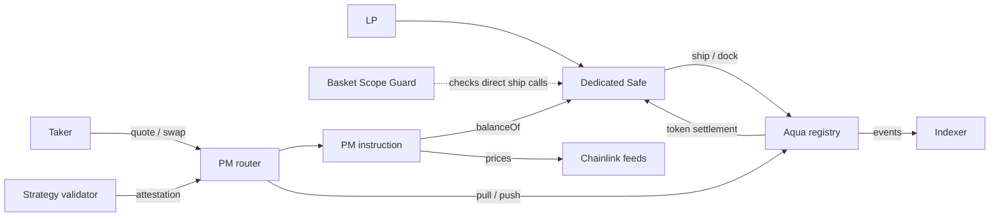

# Architecture

Portfolio Manager (PM) prices cross-group trades against a dedicated Safe wallet's real token balances.
The LP declares the token universe, group weights, feeds, and fees in an immutable strategy.
Takers choose when to trade. PM does not initiate rebalances.

## Components

| Component | Responsibility |
|---|---|
| `PortfolioManagerRouter` | Inherits SwapVM entrypoints, order handling, settlement, and the per-order reentrancy lock. |
| `PortfolioManagerSwap` | Reads group values, checks attestation and deviation, prices trades, and attempts the DAO fee transfer. |
| `PortfolioManagerArgsCodec` | Encodes and validates the immutable group configuration. |
| `OracleAdapter` | Checks feed freshness and converts balances to a common value unit. |
| `PortfolioManagerPricing` | Applies the weighted-curve formulas with conservative rounding. |
| `PortfolioManagerStrategyValidator` | Checks the declared universe and initial portfolio composition, then records attestation. |
| `BasketScopeGuard` | Restricts direct Aqua `ship()` calls from the Safe by strategy hash and token group. |
| Indexer | Tracks strategies across all Aqua apps. See its [README](../packages/indexer/README.md). |

Contract sources are in [packages/contracts/src](../packages/contracts/src/).
The LP app and monitoring dashboard remain part of the planned grant scope.

## Balances and configuration

Pricing uses each declared token's `balanceOf(maker)` so it reflects settlement across the wallet's strategies.
Every group member uses its own oracle feed, including members of single-token groups.
All feeds must use the same quote currency.

Aqua's `safeBalances` and `rawBalances` read its per-`(maker, app, strategyHash)` ledger.
That ledger authorizes settlement amounts. It does not measure wallet-wide exposure.
The router is the `app` address for PM strategies.

The strategy hash commits to the encoded order and its configuration.
Changing the configuration requires a new strategy.
The Guard's trusted hash and group mapping are immutable, so changes to them also require a new Guard.
See [ADR-0002](adr/0002-dedicated-maker-wallet-as-portfolio-scope.md) and [ADR-0011](adr/0011-safe-wallet-with-basket-scope-guard.md).

## Trade flow

1. SwapVM checks the order and starts the PM instruction.
2. PM requires an attestation for the order hash before decoding its arguments.
3. PM resolves the traded tokens to different declared groups.
4. PM reads both groups' real balances and oracle prices.
5. If enabled, the circuit breaker checks the pair's current price deviation.
6. PM converts the traded amount to value units and computes the quote.
7. PM converts the result to native token units and checks the output token's available balance.
8. During execution, PM attempts the DAO fee transfer. Quotes skip this transfer.
9. SwapVM settles through Aqua's `pull()` and `push()` calls.

The Safe must approve Aqua to transfer each declared token.
See [wallet setup](guides/fresh-wallet-setup.md) and [pricing](PRICING.md) for the procedure and formulas.

## Security boundaries

- **Current balances:** pricing has no moving average. The simulation's fee-and-gas profitability gate models taker behavior, not an on-chain scheduler.
- **Oracles:** a stale or non-positive price reverts the trade. Every feed in either traded group must pass.
- **Attestation:** validates the encoded configuration. It does not bind a later `ship()` call's token array or guarantee that wallet balances remain unchanged.
- **Guard coverage:** the Guard checks direct Aqua `ship()` calls. It does not inspect calls nested inside a batch or other contract.
- **Wallet control:** owners can withdraw tokens or remove the Guard. Prior strategies and arbitrary-call modules require separate onboarding checks.
- **Circuit breaker:** an enabled breaker can block a skewed pair until an external action restores it. See [ADR-0012](adr/0012-price-deviation-circuit-breaker.md).
- **Invariant:** the [proof](DONATION-RESISTANCE-PROOF.md) concerns the curve's own trades and donations under its stated assumptions. It is not a guarantee about arbitrary wallet activity.
- **Protocol fee:** the transfer is part of the curve opcode, but collection is best-effort. A failed transfer emits `ProtocolFeeSkipped` and does not revert the swap.

## Integration and evidence

The independent router requires manual inclusion by 1inch for Pathfinder routing, as recorded in [ADR-0010](adr/0010-on-chain-form-aquaapp-vs-swapvm-instruction.md).
Deployment alone does not provide routing traffic.

[Contract tests](../packages/contracts/README.md) cover local execution and a Base fork.
[Simulation notebooks](../simulation/README.md) use synthetic prices and assumed gas costs.
They do not establish live trading performance, actual contract gas costs, or aggregator routing behavior.
See the [roadmap](ROADMAP.md) for grant status and the [ADR index](adr/README.md) for design rationale.
