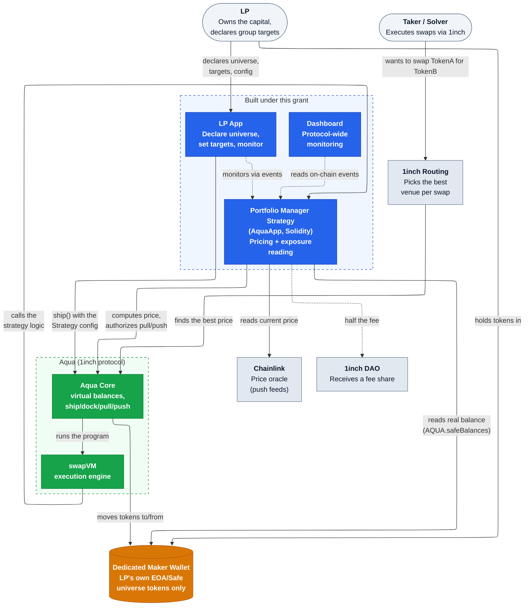
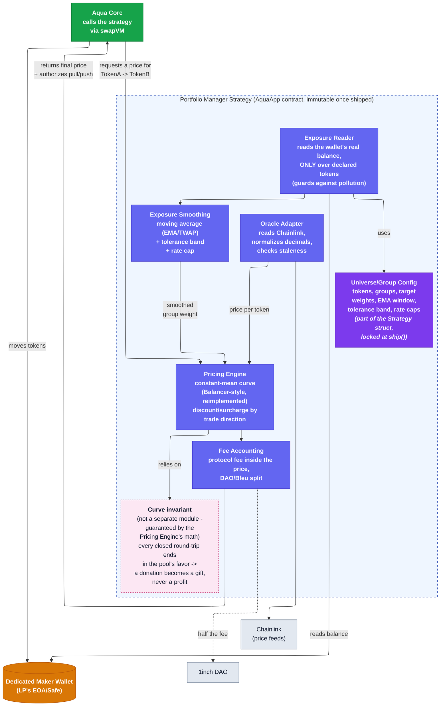

# Architecture

**Status: proposed, pre-Milestone 1.** The exact on-chain form — a pure `AquaApp`, a new
swapVM instruction, or a hybrid — is formally a Milestone 1 decision (mechanism research +
spec + simulation, per the grant's decision record; see
[`adr/0010-on-chain-form-aquaapp-vs-swapvm-instruction.md`](adr/0010-on-chain-form-aquaapp-vs-swapvm-instruction.md)).
This document assumes the `AquaApp` path, since that's what the decision record currently
leans toward ("needs multi-token portfolio state + cross-group logic"), and is grounded
against the real interfaces in `lib/aqua/src/interfaces/IAqua.sol` and
`lib/aqua/src/AquaApp.sol`. Treat it as the current working assumption, not a closed decision.

Every other design choice reflected in the diagrams below has its own ADR in
[`adr/`](adr/README.md) — see the component notes for links.

## Key technical decisions

| Decision | Status | ADR |
|---|---|---|
| License this repo's code under Aqua-Source-1.1, not MIT | Accepted | [0001](adr/0001-license-under-aqua-source-not-mit.md) |
| Dedicated maker wallet as portfolio scope, zero Aqua protocol changes | Accepted | [0002](adr/0002-dedicated-maker-wallet-as-portfolio-scope.md) |
| Oracle-valued token groups, not per-token targets | Accepted | [0003](adr/0003-oracle-valued-token-groups.md) |
| Constant-mean weighted curve pricing, reimplemented independently | Accepted | [0004](adr/0004-constant-mean-weighted-curve-pricing.md) |
| Chainlink-style push oracles, bluechip-first | Accepted | [0005](adr/0005-chainlink-push-oracles.md) |
| EMA/TWAP + tolerance band + rate caps for exposure smoothing | Accepted | [0006](adr/0006-exposure-smoothing.md) |
| Donation resistance via curve invariant, not internal accounting | Accepted | [0007](adr/0007-donation-resistance-via-curve-invariant.md) |
| Success = tracking error + cost of rebalancing, not fee/volume | Accepted | [0008](adr/0008-success-metrics-tracking-error-and-cost.md) |
| Deploy on Base at launch | Accepted | [0009](adr/0009-deploy-on-base-at-launch.md) |
| On-chain form: `AquaApp` vs. swapVM instruction vs. hybrid | **Proposed** | [0010](adr/0010-on-chain-form-aquaapp-vs-swapvm-instruction.md) |

**On the open one — should this use swapVM at all?** Reading the actual `lib/swap-vm` source
changes what this question means:

- **A swapVM instruction isn't something a strategy author can add unilaterally.** The opcode
  table (`AquaOpcodes._opcodes()` in `lib/swap-vm/src/opcodes/AquaOpcodes.sol`) is a fixed-size
  array of internal function pointers baked into whichever router contract deploys it —
  currently `AquaSwapVMRouter`, holding 1inch's own opcode set (`XYCSwap`, `XYCConcentrate`,
  `Decay`, `Fee`, `PeggedSwap`, `Extruction` — no weighted/constant-mean curve). Adding our own
  opcode to *that* router means 1inch merging and redeploying it. Deploying *our own* router
  (inheriting `SwapVM` with a custom opcode set) is technically possible but pulls in the
  entire `SwapVM.sol` plumbing (EIP-712 order signing, taker-traits parsing, WETH unwrap,
  maker hooks/callbacks) as part of our own deployed, audited surface — most of it irrelevant
  to a single-strategy portfolio manager.
- **Instructions can hold persistent storage** — `Invalidators.sol` proves this (per-maker,
  per-order mappings, gated by `!ctx.vm.isStaticContext` so `quote()` calls don't mutate
  state). The earlier assumption that swapVM instructions are necessarily stateless/pure
  (true of `XYCSwap._xycSwapXD`, which is `pure`) doesn't generalize — the framework supports
  exactly the kind of persistent EMA/smoothing state [ADR-0006](adr/0006-exposure-smoothing.md)
  needs. This removes one presumed blocker, but not the router-deployment problem above.
- **A real "hybrid" is narrower than it first sounds.** `SwapVM.swap()`/`quote()` are full
  external entrypoints built around taker-initiated calls with their own order/signature
  semantics — an external `AquaApp` can't cheaply "call into" the deployed router for just the
  pricing math; the instruction functions (like `_xycSwapXD`) are `internal`, reachable only by
  inheriting the instruction contract directly. That's really the `AquaApp` path with an
  optional pure-math import — not meaningfully different from ADR-0010's first option, since
  swapVM ships no weighted curve to import in the first place.

None of this closes ADR-0010 — the M1 simulation still has to produce real gas/frontier
numbers — but it does mean the "new swapVM instruction" and "hybrid" options carry a
dependency on 1inch's own router (redeployment, or a competing router nobody uses yet) that
`AquaApp` doesn't. See [ADR-0010](adr/0010-on-chain-form-aquaapp-vs-swapvm-instruction.md) for
the full record.

## System context (L1)

**What this grant builds** (blue boxes): the strategy contract, the LP-facing web app, and the
protocol-wide monitoring dashboard. Everything else — Aqua, swapVM, Chainlink, 1inch's own
routing — already exists; we only integrate against it.

**The dedicated maker wallet** (orange) is the load-bearing design choice: a fresh wallet
(EOA or Safe) the LP creates and funds only with universe tokens. Every strategy shipped from
it settles into it, so its real, on-chain, `AQUA.safeBalances()`-readable balance already *is*
the true net exposure — no new accounting primitive needed, and zero protocol changes.

## Contract internals (L2)

### Component notes, grounded against the real Aqua interfaces

- **Universe/Group Config** — part of the `strategy` bytes payload passed to
  [`IAqua.ship()`](../lib/aqua/src/interfaces/IAqua.sol), hashed into the immutable
  `strategyHash`. There is no update path; changing a parameter means shipping a new strategy
  and docking the old one via [`IAqua.dock()`](../lib/aqua/src/interfaces/IAqua.sol). See
  [ADR-0002](adr/0002-dedicated-maker-wallet-as-portfolio-scope.md) and
  [ADR-0003](adr/0003-oracle-valued-token-groups.md).
- **Exposure Reader** — reads via
  [`AQUA.safeBalances(maker, app, strategyHash, token0, token1)`](../lib/aqua/src/interfaces/IAqua.sol),
  but **only over tokens the LP declared** in the Config — anything else sitting in the wallet
  (by accident or an intentional donation) is ignored by this read. This is the mitigation for
  "watched wallet ≠ guaranteed-clean wallet" (the wallet is real, so anyone can transfer into
  it — see [ADR-0002](adr/0002-dedicated-maker-wallet-as-portfolio-scope.md)).
- **Exposure Smoothing** — an EMA/TWAP over the raw reading, plus a tolerance band and a rate
  cap (max rebalance frequency/amount), so a single-block balance change can't move the quoted
  price instantly. This is necessary, not sufficient, for donation resistance — see Invariant
  below. See [ADR-0006](adr/0006-exposure-smoothing.md).
- **Oracle Adapter** — Chainlink-style push feeds only, not a pull oracle (Pyth was
  considered and rejected specifically because the taker could choose which still-valid price
  to post — see [ADR-0005](adr/0005-chainlink-push-oracles.md)).
- **Pricing Engine** — the constant-mean weighted curve, i.e. Balancer's weighted-pool
  formula (the 80/20 BAL/WETH pool is the best-known public example of this exact math with
  unequal weights), *reimplemented from scratch*. See
  [`THIRD_PARTY_NOTICES.md`](../THIRD_PARTY_NOTICES.md) and
  [ADR-0004](adr/0004-constant-mean-weighted-curve-pricing.md) for why the formula is fine to
  reuse but Balancer's GPL-licensed Solidity is not.
- **Curve invariant** — not its own contract or function, a *property* the Pricing Engine's
  math must satisfy: any closed round-trip trade ends slightly in the strategy's favor. That
  property is what turns a "donation attack" (transferring tokens into the wallet to skew the
  reading) into an irreversible gift rather than an extractable profit. **Proving this formally
  is Milestone 1's headline security deliverable — it is asserted here as a design requirement,
  not yet demonstrated with numbers.** See
  [ADR-0007](adr/0007-donation-resistance-via-curve-invariant.md).
- **Fee Accounting** — the 2 bps protocol fee must be computed *inside* the same cost model
  used to evaluate the mechanism against baselines (see
  [ADR-0008](adr/0008-success-metrics-tracking-error-and-cost.md)) — comparing the strategy's
  all-in cost including this fee against a fee-free naive baseline would overstate how well the
  mechanism performs.
- **Reentrancy** — `AquaApp` requires swap-handling functions to be wrapped in its
  `nonReentrantStrategy(maker, strategyHash)` modifier before calling `_safeCheckAquaPush`;
  this is a hard requirement from the base contract, not a project-specific choice.

## Open decisions (Milestone 1)

- **On-chain form**: `AquaApp` (assumed here) vs. a new swapVM instruction vs. a hybrid. See
  [ADR-0010](adr/0010-on-chain-form-aquaapp-vs-swapvm-instruction.md) — the only ADR in this
  repo still `Proposed` rather than `Accepted`.
- **Formal proof** of the round-trip/donation-resistance invariant — currently a design
  requirement, not yet proven. See [ADR-0007](adr/0007-donation-resistance-via-curve-invariant.md).
- **Concrete parameter values** — EMA window, tolerance band width, rate caps — depend on the
  Milestone 1 simulation comparing candidates against naive rebalancing baselines. See
  [ADR-0006](adr/0006-exposure-smoothing.md) and
  [ADR-0008](adr/0008-success-metrics-tracking-error-and-cost.md).
- **Licensing** — see [`LICENSING-RISK.md`](LICENSING-RISK.md) and
  [ADR-0001](adr/0001-license-under-aqua-source-not-mit.md). This affects what "open source"
  actually means for this repo's own contracts, independent of the mechanism design.

See [`adr/README.md`](adr/README.md) for the full decision log, including chain choice
([ADR-0009](adr/0009-deploy-on-base-at-launch.md)) and the group/pricing/oracle decisions
behind the diagrams above.
