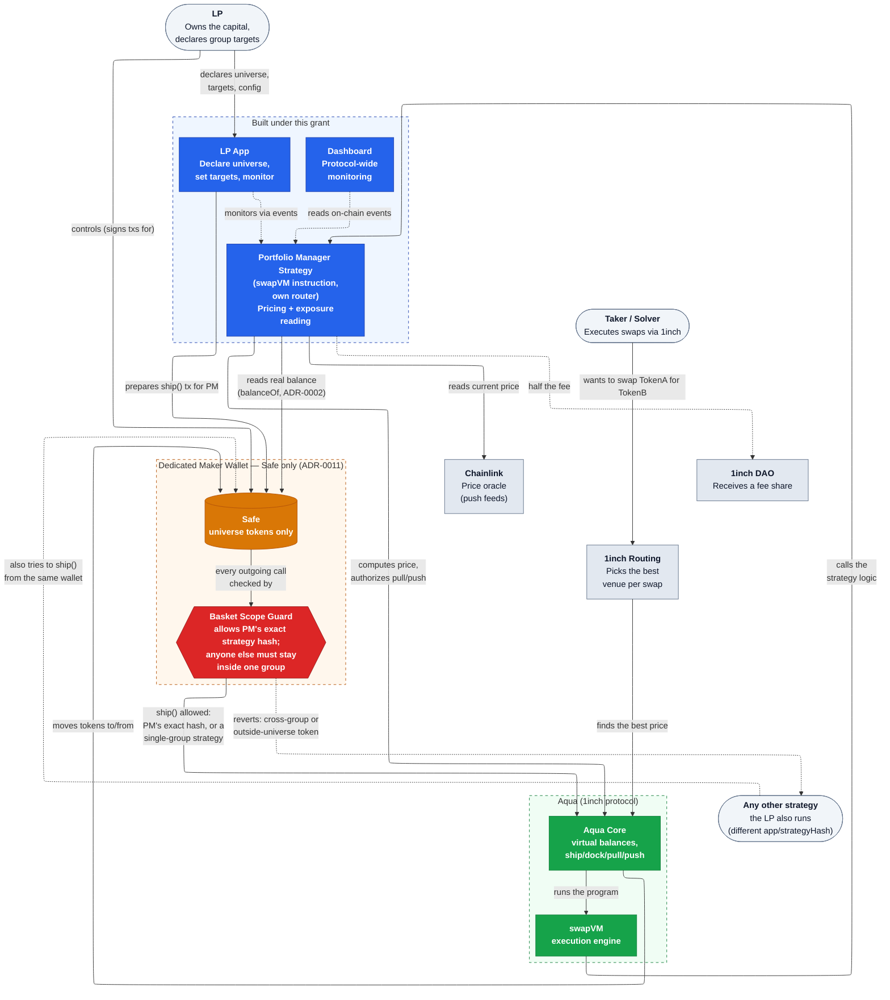
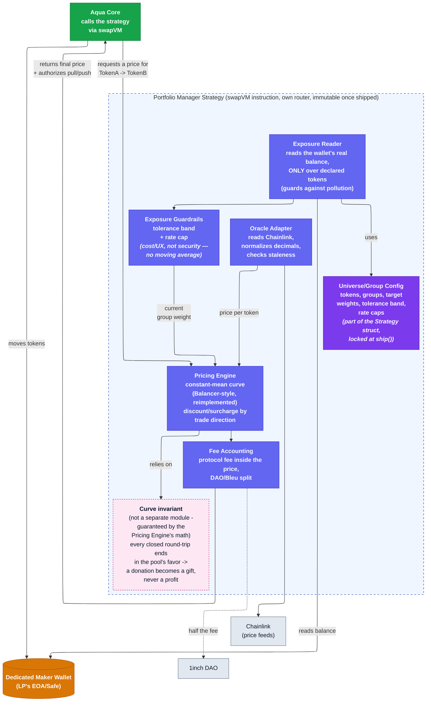

# Architecture

**Status: Milestone 1 complete.** The strategy ships as a new swapVM instruction, deployed via
an independent router we own (inheriting `SwapVM` with our own opcode set) — not a pure
`AquaApp`, not a hybrid, and not merged into 1inch's own `AquaSwapVMRouter`. See
[`adr/0010-on-chain-form-aquaapp-vs-swapvm-instruction.md`](adr/0010-on-chain-form-aquaapp-vs-swapvm-instruction.md)
for the full decision and reasoning. The
frontier comparison is done now (see [Milestone 1](#milestone-1) below) and confirms the
mechanism beats naive rebalancing baselines; real gas numbers are still a placeholder pending
on-chain benchmarking. The round-trip/donation-resistance proof is done
([ADR-0007](adr/0007-donation-resistance-via-curve-invariant.md)); the cross-strategy
manipulation gap it doesn't cover is closed structurally, not proven, by a Safe wallet
requirement and a Basket Scope Guard, now built and tested
([ADR-0011](adr/0011-safe-wallet-with-basket-scope-guard.md)).

Every other design choice reflected in the diagrams below has its own ADR in
[`adr/`](adr/README.md) — see the component notes for links.

## Key technical decisions

| Decision | Status | ADR |
|---|---|---|
| License this repo's code under Aqua-Source-1.1, not MIT | Accepted | [0001](adr/0001-license-under-aqua-source-not-mit.md) |
| Dedicated maker wallet as portfolio scope, zero Aqua protocol changes | Accepted | [0002](adr/0002-dedicated-maker-wallet-as-portfolio-scope.md) |
| Oracle-valued token groups, not per-token targets | Accepted | [0003](adr/0003-oracle-valued-token-groups.md) |
| Constant-mean weighted curve pricing, reimplemented independently | Accepted | [0004](adr/0004-constant-mean-weighted-curve-pricing.md) |
| Chainlink-style push oracles, bluechip-first | Accepted | [0005](adr/0005-chainlink-push-oracles.md) |
| Tolerance band + rate caps for exposure guardrails (no EMA/TWAP) | Accepted | [0006](adr/0006-exposure-smoothing.md) |
| Donation resistance via curve invariant, not internal accounting | Accepted | [0007](adr/0007-donation-resistance-via-curve-invariant.md) |
| Success = tracking error + cost of rebalancing, not fee/volume | Accepted | [0008](adr/0008-success-metrics-tracking-error-and-cost.md) |
| Deploy on Base at launch | Accepted | [0009](adr/0009-deploy-on-base-at-launch.md) |
| On-chain form: independent router, new swapVM instruction (not `AquaApp`, not merged into 1inch's router) | Accepted | [0010](adr/0010-on-chain-form-aquaapp-vs-swapvm-instruction.md) |
| Safe-only maker wallet with a Basket Scope Guard, instead of bounding cross-strategy risk | Accepted | [0011](adr/0011-safe-wallet-with-basket-scope-guard.md) |

**Why an independent router, not `AquaApp` and not merged into 1inch's own router.** Reading
the actual `lib/swap-vm` source is what settled this:

- **A swapVM instruction isn't something a strategy author can add unilaterally.** The opcode
  table (`AquaOpcodes._opcodes()` in `lib/swap-vm/src/opcodes/AquaOpcodes.sol`) is a fixed-size
  array of internal function pointers baked into whichever router contract deploys it —
  currently `AquaSwapVMRouter`, holding 1inch's own opcode set (`XYCSwap`, `XYCConcentrate`,
  `Decay`, `Fee`, `PeggedSwap`, `Extruction` — no weighted/constant-mean curve). Adding our own
  opcode to *that* router means 1inch merging and redeploying it. Deploying *our own* router
  (inheriting `SwapVM` with a custom opcode set) is technically possible but pulls in the
  entire `SwapVM.sol` plumbing (EIP-712 order signing, taker-traits parsing, WETH unwrap,
  maker hooks/callbacks) as part of our own deployed, audited surface — most of it irrelevant
  to a single-strategy portfolio manager.
- **Instructions can hold persistent storage** — `Invalidators.sol` proves this (per-maker,
  per-order mappings, gated by `!ctx.vm.isStaticContext` so `quote()` calls don't mutate
  state). The earlier assumption that swapVM instructions are necessarily stateless/pure
  (true of `XYCSwap._xycSwapXD`, which is `pure`) doesn't generalize — the framework supports
  exactly the kind of persistent EMA/smoothing state [ADR-0006](adr/0006-exposure-smoothing.md)
  needs. This removes one presumed blocker, but not the router-deployment problem above.
- **A real "hybrid" is narrower than it first sounds.** `SwapVM.swap()`/`quote()` are full
  external entrypoints built around taker-initiated calls with their own order/signature
  semantics — an external `AquaApp` can't cheaply "call into" the deployed router for just the
  pricing math; the instruction functions (like `_xycSwapXD`) are `internal`, reachable only by
  inheriting the instruction contract directly. That's really the `AquaApp` path with an
  optional pure-math import — not meaningfully different from ADR-0010's first option, since
  swapVM ships no weighted curve to import in the first place.

This is what decided it: merging into 1inch's own router carries a cooperation/timeline
dependency neither of the other two paths do, and the PoC already proves the own-router path
works for the multi-token-balance-read question. The M1 simulation still has to produce real
gas numbers and the tracking-error/cost frontier — those weren't the basis for this decision,
and still gate the rest of Milestone 1. See
[ADR-0010](adr/0010-on-chain-form-aquaapp-vs-swapvm-instruction.md) for
the full record.

## System context (L1)

**What this grant builds** (blue boxes): the strategy contract, the LP-facing web app, and the
protocol-wide monitoring dashboard. Everything else — Aqua, swapVM, Chainlink, 1inch's own
routing — already exists; we only integrate against it.

**The dedicated maker wallet** (orange) is the load-bearing design choice: a fresh **Safe** —
not an EOA, see [ADR-0011](adr/0011-safe-wallet-with-basket-scope-guard.md) — the LP creates and
funds only with universe tokens. Every strategy shipped from it settles into it, so its real,
on-chain, `balanceOf`-readable balance already *is* the true net exposure — no new accounting
primitive needed, and zero protocol changes (see
[ADR-0002](adr/0002-dedicated-maker-wallet-as-portfolio-scope.md) for why this reads
`balanceOf` directly and not `AQUA.safeBalances()`, which is a same-strategy-only ledger, not a
wallet-wide reading).

**The Basket Scope Guard** (red) is what makes that safe to share with other strategies at all.
It's a Safe Transaction Guard, not part of the strategy contract itself — installed on the
wallet, it inspects every `ship()` call before the Safe makes it. PM's own, exact strategy hash
is always allowed (it's the trusted mechanism meant to price across groups); anything else must
stay within a single declared group, and can't touch a token outside the universe at all. See
[ADR-0011](adr/0011-safe-wallet-with-basket-scope-guard.md) and
[`thoughts/basket-scope-guard-design.md`](../thoughts/basket-scope-guard-design.md) for the
mechanism and its real limits (module-transaction coverage, pre-existing strategies, guard
removal).

## Contract internals (L2)

### Component notes, grounded against the real Aqua interfaces

- **Universe/Group Config** — part of the `strategy` bytes payload passed to
  [`IAqua.ship()`](../lib/aqua/src/interfaces/IAqua.sol), hashed into the immutable
  `strategyHash`. There is no update path; changing a parameter means shipping a new strategy
  and docking the old one via [`IAqua.dock()`](../lib/aqua/src/interfaces/IAqua.sol). See
  [ADR-0002](adr/0002-dedicated-maker-wallet-as-portfolio-scope.md) and
  [ADR-0003](adr/0003-oracle-valued-token-groups.md).
- **Exposure Reader** — reads via plain `balanceOf(token)` on the maker wallet, **not**
  `AQUA.rawBalances`/`safeBalances` (those are the same per-`(maker, app, strategyHash)` ledger,
  scoped to this one strategy only — not a wallet-wide reading; see
  [ADR-0002](adr/0002-dedicated-maker-wallet-as-portfolio-scope.md) for the full correction),
  and **only over tokens the LP declared** in the Config — anything else sitting in the wallet
  (by accident or an intentional donation) is ignored by this read.
- **Exposure Guardrails** — a tolerance band and a rate cap (max rebalance frequency/amount) on
  the *current* real reading, no moving average. Donation resistance doesn't depend on these —
  that's fully closed by the curve invariant alone (see Invariant below). Cross-strategy
  resistance also doesn't depend on these — it's not this contract's job at all: it's closed
  structurally, at the wallet level, by the Basket Scope Guard (
  [ADR-0011](adr/0011-safe-wallet-with-basket-scope-guard.md), see the L1 diagram above). These
  guardrails exist only to reduce unnecessary rebalancing churn and cost. See
  [ADR-0006](adr/0006-exposure-smoothing.md).
- **Oracle Adapter** — Chainlink-style push feeds only, not a pull oracle (Pyth was
  considered and rejected specifically because the taker could choose which still-valid price
  to post — see [ADR-0005](adr/0005-chainlink-push-oracles.md)).
- **Pricing Engine** — the constant-mean weighted curve, i.e. Balancer's weighted-pool
  formula (the 80/20 BAL/WETH pool is the best-known public example of this exact math with
  unequal weights), *reimplemented from scratch*. See
  [`THIRD_PARTY_NOTICES.md`](../THIRD_PARTY_NOTICES.md) and
  [ADR-0004](adr/0004-constant-mean-weighted-curve-pricing.md) for why the formula is fine to
  reuse but Balancer's GPL-licensed Solidity is not. Full formula: [`PRICING.md`](PRICING.md).
- **Curve invariant** — not its own contract or function, a *property* the Pricing Engine's
  math must satisfy: any closed round-trip trade ends slightly in the strategy's favor. That
  property is what turns a "donation attack" (transferring tokens into the wallet to skew the
  reading) into an irreversible gift rather than an extractable profit — proven, not just
  asserted (see [`INVARIANT-PROOF.md`](INVARIANT-PROOF.md) and
  [ADR-0007](adr/0007-donation-resistance-via-curve-invariant.md)). This proof covers PM's own
  trades and pure donations — it does **not**, by itself, cover a *different* strategy trading
  against the same wallet (that's a two-sided balance change, not a donation, and
  [`thoughts/cross-strategy-manipulation.md`](../thoughts/cross-strategy-manipulation.md) found a
  concrete exploit through exactly that gap). What makes the invariant's precondition hold for
  cross-strategy activity too is the Basket Scope Guard
  ([ADR-0011](adr/0011-safe-wallet-with-basket-scope-guard.md)), not this proof.
- **Fee Accounting** — the 2 bps protocol fee must be computed *inside* the same cost model
  used to evaluate the mechanism against baselines (see
  [ADR-0008](adr/0008-success-metrics-tracking-error-and-cost.md)) — comparing the strategy's
  all-in cost including this fee against a fee-free naive baseline would overstate how well the
  mechanism performs.
- **Reentrancy** — handled by `SwapVM.sol` itself, not `AquaApp`'s
  `nonReentrantStrategy` modifier: a per-`orderHash` transient lock
  (`_reentrancyGuards[orderHash]`) taken before the instruction runs and released after. Since
  the strategy is a swapVM instruction on our own router (ADR-0010), this guard is inherited
  from the base framework, not something the instruction itself has to implement.

## Milestone 1

- **Formal proof** of the round-trip/donation-resistance invariant — done: any closed
  round-trip ends at or above where it started, proven algebraically and independent of how
  the pre-trade balance arose (the strategy's own trades or a donation), then checked against
  the implementation across 200,000 random trades. See
  [`INVARIANT-PROOF.md`](INVARIANT-PROOF.md),
  [ADR-0007](adr/0007-donation-resistance-via-curve-invariant.md), and
  [`01_pricing_curve.ipynb`](../simulation/notebooks/01_pricing_curve.ipynb).
- **Cross-strategy manipulation** (a different strategy on the same wallet skewing the balance
  PM prices against) — closed structurally, not proven mathematically: see
  [ADR-0011](adr/0011-safe-wallet-with-basket-scope-guard.md). The Guard contract is now
  written, compiled, and tested —
  [`proofs-of-concept/basket-scope/`](../proofs-of-concept/basket-scope/), standalone, 12/12
  tests passing including integration tests against a real deployed Safe — no longer the
  sketch in
  [`thoughts/basket-scope-guard-design.md`](../thoughts/basket-scope-guard-design.md). Still
  open: an external audit, and the onboarding flow's one-time pre-existing-strategy check it
  depends on.
- **Concrete parameter values** — resolved. `tolerance_band = 0.005`, `min_steps_between_trades
  = 12` (1 hour at the simulation's 5-minute step resolution), picked in
  `simulation/notebooks/10_parameter_decision.ipynb`. Every dimension that notebook measured
  (cost, tracking error, shock-recovery time, stale-quote exploit exposure) gets monotonically
  worse as either knob loosens — the chosen values are a deliberate step back from the
  in-model mathematical optimum (`0.001`/`1`), trading simulated performance for a >10x
  reduction in worst-case correction frequency against gas cost this suite doesn't model
  (placeholder pending gas-per-rebalance benchmarking). See
  [ADR-0006](adr/0006-exposure-smoothing.md) and
  [ADR-0008](adr/0008-success-metrics-tracking-error-and-cost.md).
- **Licensing** — see [`LICENSING-RISK.md`](LICENSING-RISK.md) and
  [ADR-0001](adr/0001-license-under-aqua-source-not-mit.md). This affects what "open source"
  actually means for this repo's own contracts, independent of the mechanism design.

### Simulation results

Ten notebooks (`simulation/notebooks/`), each with real assertions checked in code — see
[`simulation/README.md`](../simulation/README.md) for the full table.

- The mechanism beats both naive rebalancing baselines (periodic and threshold) on the
  tracking-error/cost-of-rebalancing frontier, at every one of 10 swept baseline settings
  ([`05_frontier_sweep.ipynb`](../simulation/notebooks/05_frontier_sweep.ipynb)).
- After a severe price shock (-30%), the mechanism recovers ~1183x faster than a
  weekly-rebalance baseline (~25 minutes vs. ~20.5 days)
  ([`06_price_shocks.ipynb`](../simulation/notebooks/06_price_shocks.ipynb)).
- Sustained adversarial pressure doesn't raise the LP's realized cost — every attacking trade
  pays the same fee the invariant proof shows always benefits the pool. A stale-quote exploit
  right after a shock is bounded (~1.1% of portfolio for a severe shock) and controllable via
  the rate cap
  ([`07_adversarial_agent.ipynb`](../simulation/notebooks/07_adversarial_agent.ipynb)).
- A basket association costs something structurally, even from a dormant co-strategy — a
  finding the still-unbuilt multi-token group routing design (`BLEUDEV-75`) needs to account
  for, not a safety issue
  ([`08_basket_interaction.ipynb`](../simulation/notebooks/08_basket_interaction.ipynb)).
- A recommended swap fee of ~30-32bps, derived from WETH/USDC volatility and independently
  matching what the established Balancer 50/50 WETH/USDC pool already charges. Pool depth,
  not fee, is usually the binding constraint on competitiveness at launch-stage size
  ([`09_fee_recommendation.ipynb`](../simulation/notebooks/09_fee_recommendation.ipynb)).

### What Milestone 1 does and doesn't establish

**Established:** the pricing math is implemented correctly and is safe against round-trip
draining, unconditionally. Under a synthetic-then-real-calibrated market model with an
idealized always-available arbitrageur, the mechanism keeps a portfolio closer to target and
cheaper than the naive alternatives, holds up under hostile trading pressure, recovers fast
from shocks, and has concrete, evidenced parameter values.

**Not established:** performance under live trading, gas costs (a placeholder throughout
every cost number above, pending gas-per-rebalance benchmarking against the implementation),
multi-token group routing beyond the two-token pair every notebook models, and aggregator
routing behavior (the fee/competitiveness analysis compares quoted prices directly, not live
1inch routing decisions). Closing that gap is M2 (testnet, real transactions) and M4
(mainnet, real capital and unpredictable traders) — this milestone doesn't substitute for
either.

See [`adr/README.md`](adr/README.md) for the full decision log, including chain choice
([ADR-0009](adr/0009-deploy-on-base-at-launch.md)) and the group/pricing/oracle decisions
behind the diagrams above.
