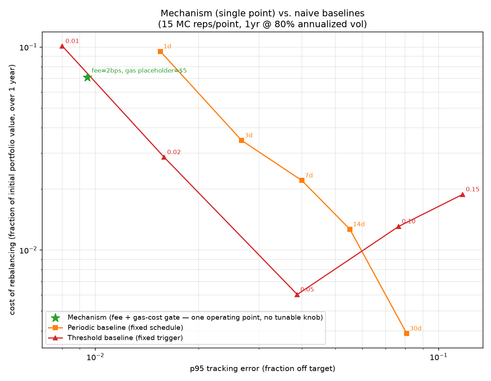
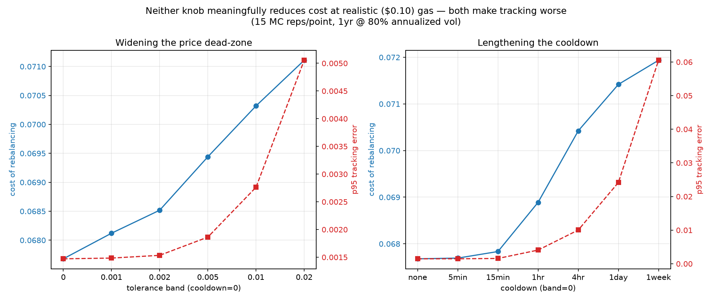

# ADR-0006: Exposure guardrails — a tolerance band and rate caps (no EMA/TWAP)

**Status:** Accepted — revised 2026-08-18 to drop the EMA/TWAP moving average, revised
2026-08-24 to pick concrete parameter values

## Context

The exposure reader (ADR-0002) reads a wallet's settled balance, which means it can move
in a single block — either from legitimate strategy settlement, another of the LP's own
strategies sharing the wallet, or from someone transferring tokens in deliberately (a donation,
see ADR-0007). The original version of this ADR fed that reading through an EMA or TWAP before
pricing, reasoning that a single-block change moving the quoted price instantly was a donation
vector.

**That reasoning didn't survive scrutiny — for donations.** ADR-0007's invariant proof
(`../INVARIANT-PROOF.md`) holds regardless of *how* the pre-trade balance got to be what it is,
for this strategy's own trades and for pure donations, as long as pricing reads the *current*
real balance directly. Smoothing didn't add donation resistance; it *cost* some, by introducing a
lag between the real balance and the quoted price that a patient attacker could trade against
during convergence — a harder, still-unresolved proof obligation (the abandoned "Part
2", see that file's git history) that the plain, un-smoothed curve never needed in the first
place. **Cross-strategy interaction turned out to need its own fix** (`ADR-0011`'s
Basket Scope Guard) — dropping smoothing didn't close that gap by itself; see the correction in
`../INVARIANT-PROOF.md`.

## Decision

No moving average. The exposure reading feeds the pricing engine directly off the current real
balance. Two guardrails remain, kept for cost/UX reasons, not security:

- **Tolerance band** — small deviations from target are priced as neutral, not corrective.
  Chosen value: **0.5%**.
- **Rate cap** — a ceiling on rebalancing frequency and amount per period. Chosen value:
  **1 hour minimum between corrective trades**.

Both values come from `simulation/notebooks/10_parameter_decision.ipynb`. Every dimension
that notebook measured — cost, tracking error, shock-recovery time, stale-quote exploit
exposure — gets monotonically worse as either knob loosens, so there's no genuine in-model
trade-off pushing toward these particular numbers over tighter ones; the mathematical
optimum found in that sweep is a 0.1% band with a 5-minute rate cap. The chosen values are a
deliberate, documented step back from that optimum: correction frequency (and so, gas cost —
a placeholder throughout this whole simulation series) scales directly with tightness, and
the chosen values allow up to 8,760 corrective transactions/year worst case versus
105,120/year at the mathematical optimum. Once a gas-per-rebalance number exists
(`BLEUDEV-265`), both knobs should tighten toward that optimum if the cost supports it — this
is a placeholder, not a final answer.

## Consequences

- Donation resistance no longer depends on any parameter choice here — it's fully closed by the
  curve invariant alone (`../INVARIANT-PROOF.md`). Cross-strategy resistance was never this
  ADR's job to close and still isn't — that's `ADR-0011`, enforced at the wallet level, not by
  any parameter picked here.
- The tolerance band and rate cap exist purely to reduce unnecessary rebalancing churn and cost
  from ordinary noise (including intra-group drift from another strategy on the shared wallet,
  which ADR-0003 already accepts by design) — not to bound an attack. Both are stateless
  functions of the *current* balance/timing, so neither reintroduces the lag problem EMA/TWAP
  had.
- Still introduces parameters — band width, rate-cap thresholds — picked from a
  tracking-error/cost-of-rebalancing simulation frontier (see ADR-0008), not a
  security-critical choice. Values above.

## Revised decision — under review, not yet applied to notebooks/other docs (2026-08-25)

**Still in progress — the reasoning below went through one real correction already; treat
the conclusion as unsettled, not final.**

The tolerance band and rate cap above are being reconsidered in favor of a **fee + gas-cost
profitability gate**: an arbitrageur's correction only fires if the drift it captures is
worth more than the trading fee plus their own real gas cost. First pass:

- A review comment asked whether the tolerance band was doing anything the trading fee
  didn't already do on its own — testing confirmed it wasn't: cost barely moved across the
  entire swept band range.
- Removing the band with no gas cost modeled made the mechanism correct on ~94% of all
  simulated 5-minute steps — unrealistic, since it implicitly assumes gas is free.
- Adding a gas cost to the arbitrageur's own profitability check, with no separate cooldown,
  initially looked like it settled the question: at a **$5 placeholder** gas cost (reused,
  unchecked, from an existing placeholder elsewhere in this simulation), corrections dropped
  to ~577/year on their own, and an explicit cooldown swept on top of that gas gate (5min
  through 1 day) changed nothing until set so loose it made tracking worse.

**That $5 figure was never actually checked against Base and turned out to be off by
roughly 50x.** Real Base transaction costs run $0.01-$0.10 (L2 execution + L1 data fee,
OpenLiquid data, Q1 2026) — corrected to **$0.10**. Redoing the comparison at the realistic
gas cost changes the picture substantially:

At $0.10 gas, the gate barely throttles anything — corrections fire almost as often as with
no gas cost at all, because $0.10 is cheap enough that nearly any real drift is worth
correcting. The mechanism's cost is no longer gas-bound; it's now dominated by **cumulative
trading-fee drag** from correcting near-continuously (2 bps × a very large number of
corrections over a year adds up). Checked against the same 10 baseline settings: **0 of 10**
beat the mechanism on both cost and tracking at once — the mechanism still has by far the
tightest tracking of anything tested, but every baseline setting is now cheaper than it,
specifically because they all correct far less often.

**This walks back the "no more free parameters to pick" conclusion from the first pass.**
Once gas is priced realistically (cheap, as Base actually is), gas cost isn't what
should be limiting correction frequency — cumulative fee drag is, and nothing in the
first-pass fee+gas-only design controls that. That raised a real question: does a
dead-zone and/or cooldown *on top of* the realistic-gas mechanism actually trade cost for
tracking, the way the old tolerance band was assumed to?

**Answer: no, not meaningfully — and the reason matters.** "Cost" here isn't raw fee
accounting; it's value lost against a frictionless, instantly-rebalanced reference (an
LVR-style metric — see `metrics.py`'s `cost_of_rebalancing`), which also counts value
leaked to informed/opportunistic trades against an increasingly stale price while the pool
sits uncorrected. Sweeping both knobs independently:

Over a 200x range of correction frequency (from ~10,655 corrections/year down to 53/year),
cost barely moves (6.77% → 7.19%, a ~6% relative change) while p95 tracking error gets 40x
worse (0.15% → 6.05%). The fee savings from correcting less often are almost exactly
cancelled out by more value leaking to the market while the pool sits stale — a real,
structural property of continuously quoting a firm price (the same Loss-Versus-Rebalancing
effect the LVR literature already describes, cited in `ADR-0011`'s alternatives), not a
tuning problem. **Loosening either knob is strictly worse: it doesn't save meaningful cost,
and it makes tracking dramatically worse.** There is no cost/tracking trade-off here for a
dead-zone or cooldown to usefully exploit.

**Settled conclusion:** no tolerance band, no cooldown. `fee` (fixed by ADR-0008) and
`gas_cost_b` (the realistic Base placeholder) are the only two parameters, and the
mechanism should correct as tightly and often as gas-cost profitability allows — anything
looser only gives up tracking for no real cost benefit. This does **not** change the
cost-vs-baselines finding above (0/10 dominated): the mechanism's ~6.8% cost floor is a
structural consequence of quoting continuously at all, not something a parameter choice
inside this design can lower. Closing that gap, if it's worth closing, is a different-shape
problem than picking a band width.

This section is a proposal that has reached a settled conclusion but is not yet carried
through to `simulation/notebooks/` (03, 05, 06, 07, 08, 09 all still construct the old
tolerance-band/cooldown config, and `10_parameter_decision.ipynb` still exists), or to
`ARCHITECTURE.md`/`ROADMAP.md`'s "10/10" and "All met" language. Those are a separate,
larger follow-up once this direction is confirmed.

## References

- [`../ARCHITECTURE.md`](../ARCHITECTURE.md) — Exposure Smoothing component notes
- [`../../simulation/notebooks/10_parameter_decision.ipynb`](../../simulation/notebooks/10_parameter_decision.ipynb) — the sweep and decision behind the tolerance-band/rate-cap values this ADR is moving away from (see "Revised decision" above)
