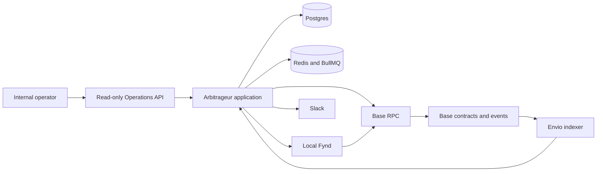
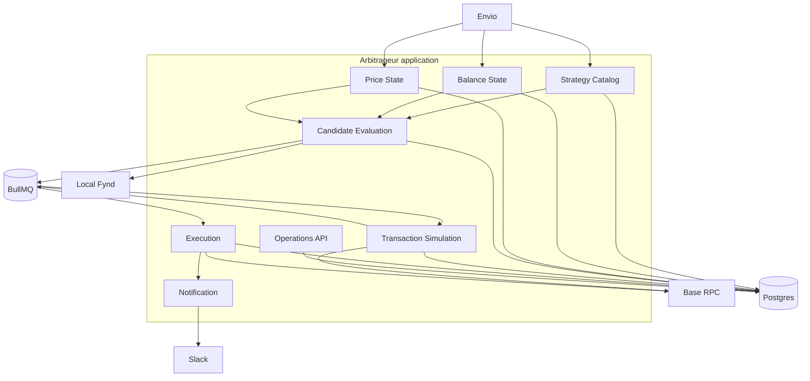
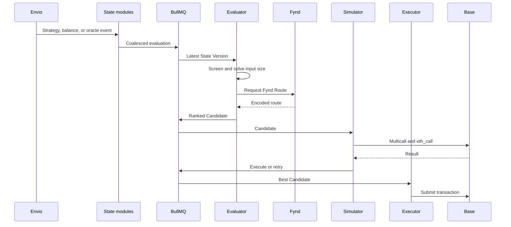
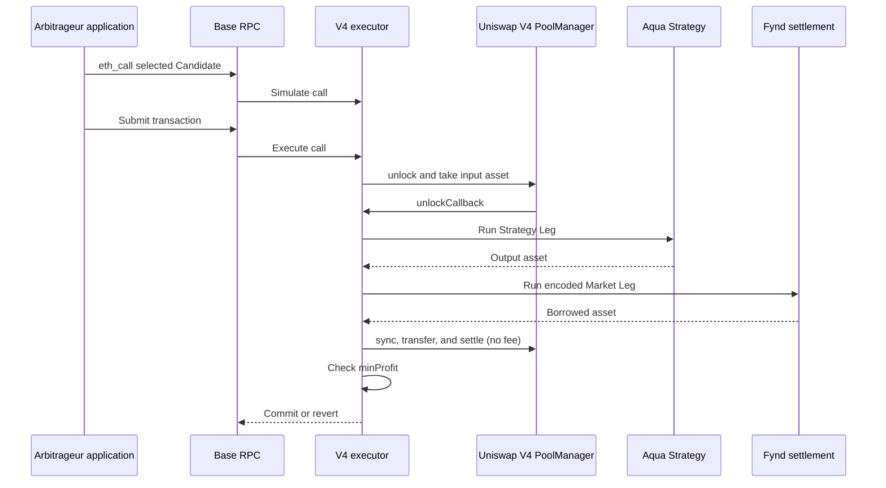

# ADR-0014: Production arbitrageur design

**Status:** Proposed

## Context

The current arbitrageur experiment uses a static strategy file and a Uniswap V4 flash-borrow path. It does not use indexed Strategy State, queues, REST operations, or durable execution records.

The production arbitrageur must discover Aqua Strategies on Base, evaluate them with indexed balances and indexed oracle prices, execute an atomic Uniswap V4 flash-loan and Fynd trade, and operate from one shared wallet.

## Decision

Run one Base-only arbitrageur application. It uses Postgres, Redis and BullMQ, Envio, local Fynd, Base RPC, Chainlink feeds, and Uniswap V4's PoolManager. It starts in dry-run mode. A configuration change enables transaction submission.

The token allow list contains USDC, USDT, WETH, and WBTC. Each token record contains its address, decimals, and Chainlink feed. The service records unsupported Strategies but does not trade them.

Uniswap V4's PoolManager charges no flash-loan fee, and it is already the flash-loan source in the existing arbitrageur experiment (see References). Aave V3 was considered instead: it would let Fynd route the Market Leg through Uniswap V4 pools without restriction, since Aave's flash loan does not hold the PoolManager's own lock. It was not chosen because it adds a fee and a second borrowing protocol to operate. Instead, Fynd's route selection excludes Uniswap V4 pools for the Market Leg -- see the Fynd Route rule under Candidate evaluation.

## System topology

Envio and Fynd are local dependencies. They are not parts of the arbitrageur application.

## Domains

| Domain | Responsibility | Services it uses |
| --- | --- | --- |
| Strategy Catalog | Store Shipped and Docked Strategies, raw program data, decoded data, and eligibility. | Envio and Postgres |
| Balance State | Store supported-token balances for each Strategy Wallet. | Envio, Base RPC, and Postgres |
| Price State | Store usable Chainlink Price Snapshots. | Envio and Postgres |
| Candidate Evaluation | Screen a Strategy State, find a Fynd Route, solve the input size, and rank Candidates. | Fynd, Postgres, Redis, and shared math |
| Transaction Simulation | Validate a Candidate against current Base state. | Base RPC, Uniswap V4 PoolManager, executor, and Postgres |
| Execution | Serialize nonces, send transactions, track results, and retry. | Base RPC, Redis, Postgres, and Slack |
| Operations API | Return authenticated, read-only operational data. | Postgres and health checks |
| Notification | Send transaction and critical-fault messages. | Slack |

## Domain and service interaction

## Indexed state

Extend Envio with these records.

| Record | Source | Required data |
| --- | --- | --- |
| Strategy Payload | `Shipped` and `Docked` | Raw program data, decoded trade data, active state, block, transaction, and log index. |
| Wallet Balance Change | `Transfer` for allow-listed tokens and Strategy Wallets | Wallet, token, signed change, block, transaction, and log index. |
| Oracle Price | `AnswerUpdated` at each feed's current aggregator | Feed, answer, decimals, time, block, transaction, and log index. |

Each Chainlink feed address on the token allow list is a proxy (`EACAggregatorProxy`). It forwards `latestRoundData()` reads to an underlying aggregator, and it can swap that aggregator over time, but it never emits `AnswerUpdated` itself -- only the aggregator does. Indexing `AnswerUpdated` at the well-known feed address indexes nothing. The indexer tracks each proxy's `AggregatorConfirmed` event to learn its current aggregator address and index `AnswerUpdated` there instead, seeded with each feed's aggregator address at indexer setup so history is available before the first tracked swap.

At Strategy discovery, the application reads supported token balances with one multicall. It then uses indexed transfers as the normal balance source. It uses one new multicall only for the selected Candidate before simulation.

A malformed or unsupported Strategy stays in the catalog with an eligibility reason. It cannot create a Candidate.

## Queue rules

BullMQ payloads contain record identifiers and a State Version. Postgres stores the full history.

| Queue | Rule |
| --- | --- |
| `sync-indexer` | Read new indexer data and store a durable cursor. |
| `evaluate-strategy` | Keep one queued job per Strategy. Replace an older State Version. |
| `simulate-candidate` | Simulate the best Candidate for a Strategy State. |
| `execute-candidate` | Run one job at a time because one wallet owns all nonces. |
| `track-transaction` | Track submission, confirmation, and indexer finality. |
| `retry-evaluation` | Re-evaluate a Candidate with new state. |

A State Version includes the Strategy Payload version, balance cursor, Price Snapshot block, Fynd Route time or block, and executor version. A worker discards an old State Version.

The service allows three retries for one Strategy State. A new Strategy, balance, oracle, or market event resets the retry count. Each retry creates new quotes, limits, and a simulation.

## Candidate evaluation

A Strategy, balance, or oracle event starts evaluation. A low-rate recovery job also starts evaluation.

The evaluator first uses Price Snapshots and TypeScript contract math. It excludes a Strategy State when the possible price difference cannot meet fees and the Profit Floor. It calls Fynd only for remaining inputs.

The evaluator tests exact input amounts within Strategy limits, Strategy Wallet balance, Uniswap V4 PoolManager liquidity, and route liquidity. It selects the amount with the highest Profit Headroom. `ProfitHeadroom` is expected return after principal less the return-token value of the Profit Floor.

Fynd finds the allowed market pools and returns an executable Fynd Route. The service configures its timeout, minimum response count, and pool allow list. The pool allow list excludes Uniswap V4: the PoolManager allows only one active `unlock` session at a time, and the executor's own flash loan already holds that session for the full trade, so a Fynd Route that opens a second `unlock` session (Fynd's Uniswap V4 execution path does this per swap group) reverts with `AlreadyUnlocked`. A route that cannot run in the executor is not eligible.

## Price and slippage rules

Price State indexes `AnswerUpdated` at each feed's current aggregator (see Indexed state). It stores one normalized price for each feed and event block. A stale, zero, negative, or unsupported price makes only affected Strategy Legs ineligible. This follows [ADR 0005](0005-chainlink-push-oracles.md).

At transaction build time, the evaluator converts the global USD Profit Floor to the expected return token with the newest usable Price Snapshot. It rejects a stale price. The executor receives that token amount as `minProfit`.

The evaluator sets minimum output amounts for both legs from pool state and configured slippage limits. The transaction reverts if either leg fails its minimum output.

TypeScript quote code must match Solidity integer math. Shared test vectors and Base-fork tests must cover rounding, invalid input, and Strategy State changes. Python simulation is not the live quote source.

## Atomic execution

Each executor version is an immutable contract that borrows from Uniswap V4's PoolManager. Postgres stores its address and version with every Execution Attempt.

The executor borrows one input asset, runs the Strategy Leg, runs the Fynd Route, repays the PoolManager, and checks `minProfit`. A failed step reverts the full transaction.

The executor has only required ERC-20 approvals for the approved Fynd settlement contract and supported tokens. It must call the Fynd Route inside the PoolManager's `unlockCallback`. It must not use a separate EOA swap.

The application rebuilds the transaction and runs `eth_call` against the latest Base state before submission. The contract also checks oracle freshness and `minProfit` during simulation and execution.

## Operations

Only the Execution domain reads `PRIVATE_KEY` from `.env`. Its worker concurrency is one. It sends transactions through public Base RPC.

The service records a submitted transaction and sends a Slack message. It marks the transaction final after one confirmation. It keeps checking until the indexer reaches its configured confirmation depth. It then stores the final result and sends a Slack message.

A failed Execution Attempt records its reason and enters the retry flow. The service never submits the same parameters again.

The service pauses new submissions when Envio, Price State, Fynd, Base RPC, Uniswap V4 simulation, or token configuration is unhealthy. It continues to index data and record Candidates. It resumes after healthy checks pass.

Configuration contains freshness limits, Fynd limits, slippage limits, Profit Floor, retry count, confirmation depth, and recovery interval.

## REST API

The internal REST API requires bearer-token authentication. It has no write endpoints.

| Endpoint | Data |
| --- | --- |
| `GET /health` | Application and dependency health, including pause state. |
| `GET /v1/strategies` | Strategies, Strategy State, and eligibility reasons. |
| `GET /v1/strategy-wallets` | Supported-token balance snapshots. |
| `GET /v1/candidates` | Candidates, estimates, rank, and rejection reason. |
| `GET /v1/execution-attempts` | Simulations, transactions, retries, and outcomes. |
| `GET /v1/config` | Safe read-only configuration. |

The API does not return secrets.

## Consequences

The service requires Envio, Fynd, Postgres, Redis, and a Base RPC provider. It does not require application-level horizontal scaling. BullMQ separates work and protects the single shared wallet from nonce conflicts.

The service must validate Uniswap V4 PoolManager liquidity, Fynd route encoding and pool-allow-list enforcement, and executor approvals for each allow-listed token before it enables transaction submission.

Transaction submission is allowed only when the service discovers supported Strategies without restart, builds current Strategy State from indexed data, proves quote parity, simulates the full Uniswap V4 flash-loan and Fynd transaction, bounds retries, pauses on stale dependencies, and stores every Execution Attempt.

## References

- [ADR 0005: Chainlink push oracles](0005-chainlink-push-oracles.md)
- [Aqua strategy indexer](../../packages/indexer/README.md)
- Existing arbitrageur branch: `origin/luizhatem/bleudev-349-arbitrageur-server-in-the-place-of-1inch-pathfinder-to-test`
